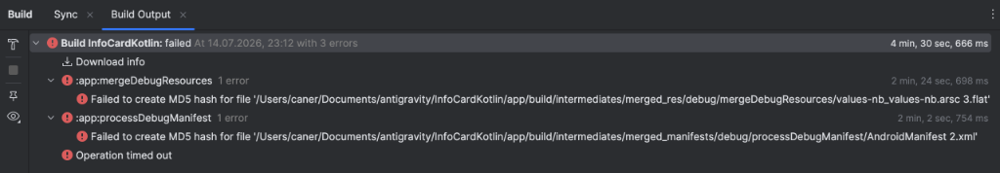
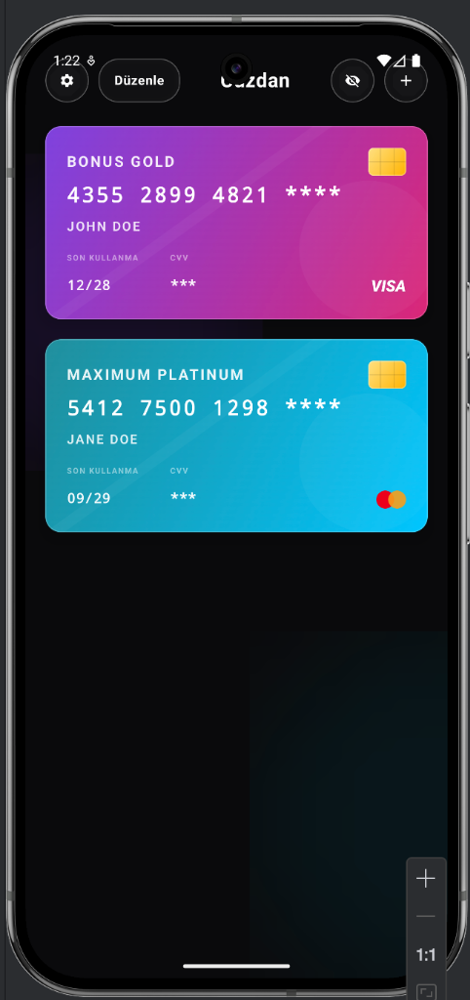

<p align="center">
  
  &nbsp;&nbsp;&nbsp;&nbsp;
  
</p>

InfoCard, kredi ve banka kartı bilgilerinizi (kart numarası, son kullanma tarihi, CVV ve kart sahibi ismi) şifreli ve tamamen yerel (local) olarak güvenle saklamanızı, yönetmenizi ve kopyalamanızı sağlayan, modern tasarımlı ve premium bir Android cüzdan uygulamasıdır.

Premium görsel estetiğe, akıcı animasyonlara ve Android ekosisteminin en son güvenlik standartlarına odaklanılarak **Jetpack Compose** ve **Kotlin** ile geliştirilmiştir.

---

### 🎨 Premium Tasarım & Jiroskopik Parallax Effect
- **Estetik Arayüz**: Koyu mod odaklı, ultra-thin material cam (glassmorphic) efektleri ve neon gradyan geçişleriyle zenginleştirilmiş premium tasarım.
- **Dynamic Parallax**: Cihazınızın jiroskop ve ivmeölçer sensörlerini (`Sensor.TYPE_ROTATION_VECTOR`) kullanarak kartlara derinlik hissi kazandıran ve el hareketlerinize göre tepki veren premium eğilme/parlama animasyonları.
- **Özelleştirilebilir Renkler**: Hazır renk gradyan şablonlarının yanı sıra renk seçici (Color Picker) kullanarak kartlarınızı istediğiniz özel renkle tasarlayabilme.
- **Wobble Düzenleme Modu**: Kartlarınızı düzenleme moduna aldığınızda akıcı bir sallanma (wobble) animasyonu eşliğinde tutup sürükleyerek (`Drag and Drop`) sıralamayı değiştirebilme.

### 🔒 Üst Düzey Güvenlik (Biometric Prompt & Encrypted Storage)
- **Biyometrik Koruma**: Android `androidx.biometric` API entegrasyonu ile parmak izi, yüz doğrulama veya cihaz PIN/desen doğrulamasıyla cüzdana erişim koruması.
- **Şifreli Yerel Depolama**: Kart bilgileriniz hiçbir harici sunucuya veya buluta yüklenmez. Jetpack Security kütüphanesi kullanılarak AES-256-GCM ile şifrelenmiş **`EncryptedSharedPreferences`** içerisinde tamamen cihazınızda saklanır.
- **Detay Maskeleme**: Tek bir dokunuşla hassas kart bilgilerini (kart numarasının son haneleri ve CVV) meraklı gözlerden gizleme veya gösterme.
- **Pano Kopyalama**: Kart numarasına dokunduğunuzda numara panoya kopyalanır ve ekranda özel bir onay animasyonu tetiklenir.

### 📷 Kamera ile Kredi Kartı Tarama (OCR)
- **Google ML Kit OCR**: Google'ın gelişmiş yapay zeka metin tanıma motoru (`ML Kit Text Recognition` & `CameraX`) ile kredi kartlarınızı kameraya göstererek kart numarasını, son kullanma tarihini ve kart sağlayıcısını saniyeler içinde otomatik olarak tanıyıp cüzdanınıza ekleme.
- **İstatistiksel Doğrulama**: Tarama kalitesini ve doğruluğunu maksimuma çıkarmak için en az 5 karelik tutarlılık oylama mekanizması sayesinde hatalı okumaları sıfıra indirir.

### 🌐 Dinamik Dil Desteği (Türkçe & English)
- **Uygulama İçi Dil Değişimi**: Ayarlar menüsünden uygulamayı tamamen Türkçe veya İngilizce diline çevirebilirsiniz.
- **Sistemle Uyumlu İsim**: Telefonun sistem dili Türkçe ise uygulama adı ana ekranda otomatik olarak **"Cüzdan"**, başka bir dilde ise **"Wallet"** olarak görünür.

---

Uygulamayı kendi Android cihazınıza yüklemek veya test etmek için aşağıdaki adımları sırasıyla uygulayabilirsiniz:

### Gereksinimler
- Android Studio (Iguana, Jellyfish veya daha yeni bir sürüm)
- Android SDK 26 (Android 8.0 Oreo) veya üzeri bir fiziksel cihaz veya emülatör
- Gradle 8.13 ve Android Gradle Plugin (AGP) 8.11.0 uyumlu ortam

### Adım Adım Kurulum Adımları
1. **Projeyi Klonlayın veya İndirin**:
   Terminali açın ve projeyi bilgisayarınıza indirin:
   ```bash
   git clone https://github.com/C4N3RR/InfoCardKotlin.git
   ```

2. **Projeyi Android Studio ile Açın**:
   - Android Studio'yu açın.
   - **Open** seçeneğini seçin ve indirdiğiniz `InfoCardKotlin` klasörünü belirtin.
   - Projenin Gradle dosyalarının senkronize olmasını bekleyin.

3. **Cihazınızı Bağlayın**:
   - Android telefonunuzda **Ayarlar > Telefon Hakkında > Derleme Numarası** seçeneğine 7 kez dokunarak Geliştirici Seçeneklerini aktif edin.
   - **Ayarlar > Sistem > Geliştirici Seçenekleri** altından **USB Hata Ayıklama (USB Debugging)** modunu açın.
   - Cihazınızı kablo ile bilgisayarınıza bağlayın ve ekrandaki izin isteğini onaylayın.

4. **Uygulamayı Çalıştırın (Run)**:
   - Android Studio'nun üst menüsünden bağlı telefonunuzu hedef cihaz olarak seçin.
   - **Yeşil Çalıştır (Run - Shift+F10)** butonuna basarak uygulamayı derleyin ve cihazınıza yükleyin.

---

## 🛠 Kullanılan Teknolojiler & Kütüphaneler
- **Jetpack Compose** (Deklaratif UI ve modern arayüz bileşenleri)
- **AndroidX Biometric** (Parmak izi ve sistem PIN doğrulama geçişi)
- **AndroidX Security Crypto** (AES-256 şifreli veri saklama)
- **CameraX & Google ML Kit Text Recognition** (Yapay zeka tabanlı gerçek zamanlı OCR kart tarama)
- **SensorManager** (Jiroskopik rotasyon vektör verilerini okuma)
- **Kotlin Coroutines & Flow** (Asenkron veri akışları ve sensör debouncing)

---

## 🔒 Gizlilik Politikası
InfoCard, gizliliğe büyük önem verir. Uygulama içerisinde kaydettiğiniz hiçbir kart verisi, şifre veya kişisel bilgi **internete yüklenmez, paylaşılmaz ve analiz edilmez**. Tüm işlemler tamamen yerel olarak cihazınızda gerçekleştirilir.
